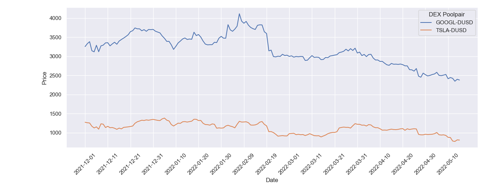

# Examples for using the API for historical DEX prices for DeFiChain

This repository includes examples on how to query historical DEX data for DeFiChain.

The API can be found under: [API for Historical DEX prices for DeFiChain](https://rapidapi.com/chrizogAPI/api/historical-dex-data-for-defichain/)

With the API you can query the historical DEX prices, i.e. the ratio of liquidity poolpairs on a daily basis. For detailed informations about the endpoints go to the details page on RapidAPI:

[Details for API for Historical DEX prices for DeFiChain](https://rapidapi.com/chrizogAPI/api/historical-dex-data-for-defichain/details)



---

## Python

The examples for Python are located in the **python** subfolder.

It's recommended to use a virtual environment. Create the virtual environment and install the dependencies:

```shell
python3 -m venv venv_lego
pip3 install -r requirements.txt
```

In [historical_data_api.py](python/historical_data_api.py) there are functions provided for querying data from the API.

[simple_query.py](python/simple_query.py) shows (as the name suggests) a simple example on how to gather data for a single day.

```shell
python3 simple_query.py
```

In [date_range_query.py](python/date_range_query.py) data is queried for a range of dates (e.g. from 1st of December until 1st of May).

```shell
python3 date_range_query.py
```